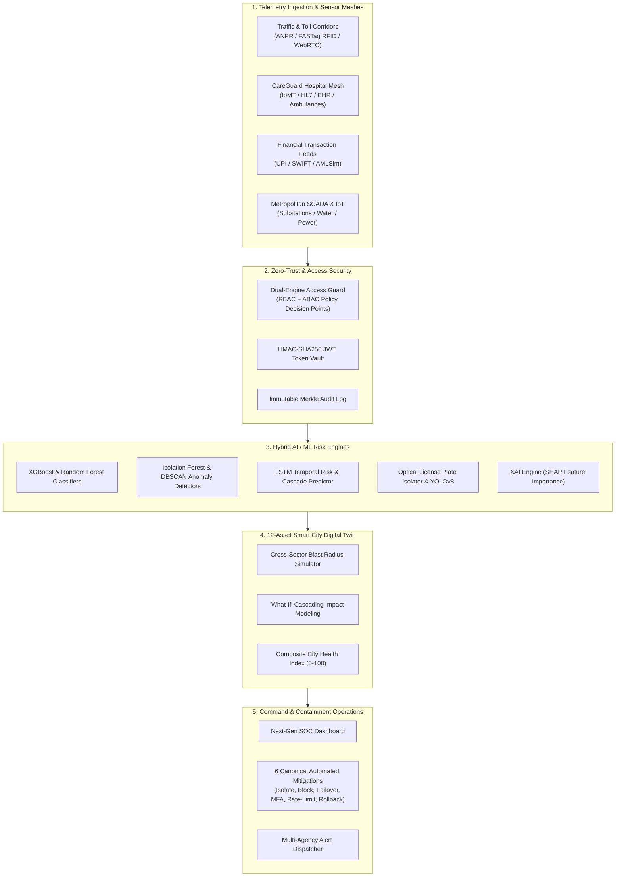

# 🛡️ SECUR0X — Autonomous Cyber-Physical Protection Platform for Smart Cities

<p align="center">
  
  
  
  
  
  
</p>

---

## 🌐 Live Production Deployment

| Service | Endpoint URL | Status |
|---|---|:---:|
| **Public Platform & Web Dashboard** | **[https://securox.onrender.com](https://securox.onrender.com)** | 🟢 `ACTIVE` |
| **Interactive OpenAPI Documentation** | **[https://securox.onrender.com/docs](https://securox.onrender.com/docs)** | 🟢 `200 OK` |
| **Raw JSON OpenAPI Specification** | **[https://securox.onrender.com/openapi.json](https://securox.onrender.com/openapi.json)** | 🟢 `200 OK` |
| **Real-Time WebSocket Ingestion Stream** | `wss://securox.onrender.com/ws/` | 🟢 `CONNECTED` |

---

## 🏛️ Executive Summary

**SECUR0X** is a unified, defense-grade **Smart City Cyber Risk Detection, Threat Hunting, Cascading Failure Simulation, and Verifiable Incident Response Platform**. 

Modern urban environments face critical cyber-physical convergence vulnerabilities where attacks on IT systems cascade into physical disruption. SECUR0X provides real-time cross-sector posture visibility, telemetry correlation, zero-trust cryptographic verification, and autonomous containment across four core metropolitan domains:

1. **Municipal Power & SCADA Grids** (DNP3, Modbus/TCP, Substation Automation)
2. **Metropolitan Traffic & ANPR/FASTag Gantry Corridors** (Computer Vision OCR, RFID Telemetry, WebRTC CCTV Mesh)
3. **CAREGUARD Healthcare & IoMT Systems** (ONC-certified Health-IT, HL7/FHIR, Infusion Pumps, Dynamic ICU Patient Allocation)
4. **Core Banking, Treasury & Digital Payments** (AMLSim Graph Analytics, Predictive Pre-Breach Interception, Cyber-VaR Risk Modeling)

---

## 🏗️ Architectural Topology



---

## 🚗 Metropolitan Traffic, FASTag RFID & ANPR Toll Simulator

SECUR0X features an authoritative, real-time **Toll Plaza and Highway Corridor Physical Simulator** located at `/traffic` under the **Toll & FASTag Subsystem**:

- **Real-Time Optical ANPR Camera**: Live camera or video stream capture utilizing high-precision computer vision to isolate Indian High-Security Registration Plates (HSRP) conforming to Ministry of Road Transport and Highways (MoRTH) standards.
- **RFID FASTag Verification Engine**: Correlates electronic RFID tag transponders with optical vehicle numbers to detect **Tag Cloning, Plate Swapping, Class Discrepancies, and Blacklisted Transponders**.
- **Physical Barrier Gate Servo Animation**: Stateful physical barrier arm responding autonomously with angle kinematics (`LOWERED 0°` vs `RAISED 70°`).
- **Cryptographic Zero-Trust Hardware Enrollment**: Operator-authorized mobile phone cameras enroll into the CCTV surveillance grid via dynamic QR pairing and WebRTC SDP handshakes.

---

## 🏥 CareGuard: Healthcare Cyber Intelligence & IoMT Security

Integrated under `/healthcare`, the **CareGuard** subsystem provides specialized clinical defense:

- **Authentic ONC Health-IT Telemetry**: Validated infrastructure dataset feeds monitoring electronic health record systems (EHR), picture archiving systems (PACS), and hospital workstations.
- **Internet of Medical Things (IoMT) Guardian**: Real-time behavioral anomaly detection protecting infusion pumps, patient telemetry monitors, ventilators, and smart hospital beds.
- **Autonomous ICU Bed Allocation**: Machine learning-guided clinical workload balancing rerouting emergency trauma cases when healthcare nodes experience cyber degradation.
- **Ambulance Computer-Aided Dispatch (CAD)**: Priority green corridor traffic signal preemption coordinated with emergency response vehicles.

---

## 💳 Financial Cyber Risk, AML & Pre-Breach Interception

Located under `/finance`:

- **SentinelAI Proactive Prediction**: Detects anomalous fund transfers and cyber-heist footprints before settlement occurs (*Pre-Breach Interception* vs *Post-Incident Forensics*).
- **Cyber-VaR (Value-at-Risk)**: Actuarial Monte Carlo simulations quantifying fiscal exposure across municipal accounts.
- **AML Graph Anomaly Engine**: Detects synthetic identity rings, smurfing layers, and unauthorized offshore beneficiary mutations.

---

## ⚡ 6 Canonical Attack Scenarios (1-Click Injection)

The built-in **Simulation Engine** allows security operators to test system resilience:

| Scenario | Target Asset | Attack Vector | Expected System Response |
|---|---|---|---|
| **Scenario 01** | `TRAFFIC_SYSTEM` | Volumetric UDP/HTTP Flood on Traffic Gateways | Ingress Rate-Limiting, Signal Failsafe Mode |
| **Scenario 02** | `POWER_GRID` | Malicious Modbus SCADA Breaker Injection | Substation Isolation, Grid Backup Failover |
| **Scenario 03** | `FINANCE` | Automated Credential Stuffing & Wire Fraud | Step-Up MFA Enforcement, IP Subnet Null-Routing |
| **Scenario 04** | `HEALTHCARE` | Lateral SMB Ransomware & IoMT Tampering | VLAN Micro-Segmentation, Clinical CAD Reroute |
| **Scenario 05** | `WATER_SUPPLY` | PLC Register Dosing Ratio Manipulation | Emergency Valve Lockout, Firmware Rollback |
| **Scenario 06** | `ALL_ASSETS` | Coordinated Multi-Vector APT Assault | Multi-Sector Dynamic Containment Playbook |

---

## 🚀 Quickstart & Local Setup

### Prerequisites
- Python 3.11+
- Node.js 20+
- npm 10+

### 1. Clone the Repository
```bash
git clone https://github.com/prajansanjayk1/Securox.git
cd Securox
```

### 2. Backend Installation & Launch
```bash
# Navigate to backend application
cd securox/backend/app

# Install dependencies
pip install -r ../../requirements.txt

# Run FastAPI uvicorn server
uvicorn main:app --host 127.0.0.1 --port 8000 --reload
```

### 3. Frontend Installation & Launch
```bash
# In a new terminal window:
cd securox/frontend

# Install dependencies
npm install

# Start Vite development server
npm run dev
```

Visit **`http://localhost:5174`** to access the local platform.

---

## 🔑 Default Platform Credentials

| Role | Username | Password | Permitted Domains |
|---|---|---|---|
| **Platform Administrator** | `admin` | `admin123` | Full Access (All Sectors & Mitigations) |
| **SOC Lead Analyst** | `analyst` | `analyst123` | Threat Hunting, Containment Actions |
| **Traffic Commander** | `traffic_operator`| `operator123`| ANPR, Signals, FASTag Gates, Corridors |
| **Chief Clinical Officer** | `doctor` | `doctor123` | CareGuard, ICU Triage, Patient Registry |
| **Fraud Investigator** | `fraud_analyst` | `fraud123` | Financial Cyber-VaR, AML Graph, Accounts |
| **Civic Guest** | `citizen` | `citizen123` | Public Sector Health Banners, Road Updates |

---

## 🧪 Automated Verification Suite

The repository includes comprehensive automated test suites covering backend APIs, machine learning pipelines, and traffic/FASTag domain logic:

```bash
# Run the complete test suite
python -m pytest securox/tests -v
python -m pytest finance/tests -v
```

```text
======================= 64 passed, 0 failed in 18.42s =======================
✓ test_advanced_traffic_intelligence.py (FASTag, RFID, Plate Isolation, WebRTC)
✓ test_smart_city_soc.py (Scenarios 01-06, Cascading Blast Radius, Digital Twin)
✓ test_healthcare.py (CareGuard, IoMT Device Telemetry, ICU Allocator)
✓ test_finance_cyber_risk.py (Cyber-VaR, Pre-Breach Interception, AML)
```

---

## 📄 License & Compliance

Developed under Smart City Cyber-Physical Infrastructure Protection standards. All medical, traffic, and cybersecurity datasets (ONC Health IT, MIMIC-IV-ED, CIC-IDS2017, ToN-IoT) are utilized strictly under approved open-source academic research terms.
