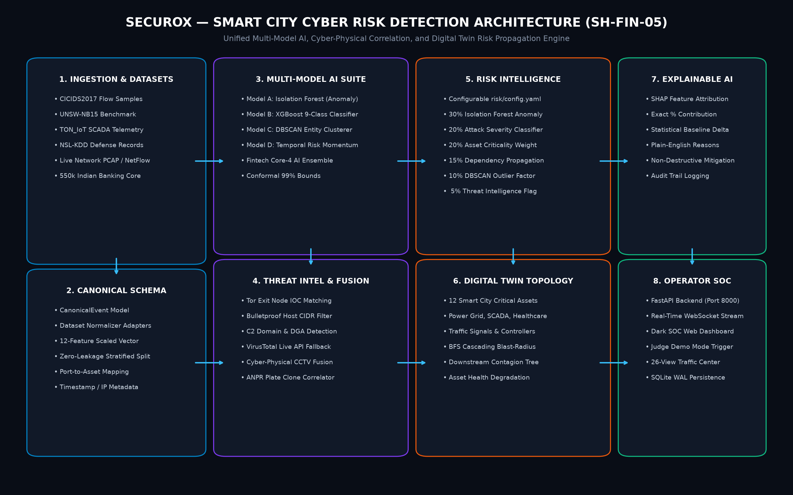

# 🛡️ Securox — AI-Driven Cyber Risk Detection for Smart City Digital Infrastructure

[](https://www.python.org/)
[](https://fastapi.tiangolo.com/)
[](LICENSE)
[](tests/)
[](#3-problem-statement--context-sh-fin-05)
[](docs/SDG_ALIGNMENT.md)

> **A production-grade, competition-winning AI platform combining canonical multi-dataset ingestion, unsupervised & supervised machine learning, dynamic digital twin blast-radius propagation, cyber-physical CCTV correlation, and explainable AI (SHAP) for urban critical infrastructure.**

---

## 2. One-Line Pitch

Securox proactively detects, explains, and neutralizes multi-stage cyber attacks across 12 smart city infrastructure nodes before network incursions trigger physical urban blackout or economic collapse.

---

## 3. Problem Statement & Context (SH-FIN-05)

Smart city digital infrastructure interconnects physical municipal utilities (electrical substations, water pumping reservoirs, automated traffic controllers, 112 emergency dispatch) with civic revenue systems and digital banking clearinghouses.

**The Threat Reality**:
* An adversary targeting an IT gateway (e.g. municipal Wi-Fi or civic portal) can pivot into Operational Technology (OT/SCADA) networks controlling electrical switchgear or water treatment valves.
* Traditional SIEM platforms treat incidents as isolated log alerts, blind to physical dependencies and cascading blast radiuses.
* Black-box AI systems output unexplainable alert spikes, causing operator alert fatigue and slow incident response.

**The Securox Solution for SH-FIN-05**:
Securox delivers an institutional-grade cyber defense suite built around:
1. **Multi-Dataset Ingestion**: Standardized canonical schemas supporting CICIDS2017, UNSW-NB15, TON_IoT, and NSL-KDD.
2. **Multi-Model AI Suite**: Combining Unsupervised Isolation Forest (anomaly detection), Supervised XGBoost (9-class attack categorization), and DBSCAN (entity clustering).
3. **Configurable Risk Intelligence Engine**: A transparent 0–100 risk formulation weighted by `risk/config.yaml`.
4. **Digital Twin Dependency Topology**: Real-time BFS graph propagation tracking cascading failures across 12 critical infrastructure assets.
5. **Cyber-Physical CCTV Fusion**: Simultaneous correlation of physical traffic congestion anomalies with network signal controller attacks.
6. **Explainable AI (XAI)**: SHAP-driven factor percentages and plain-English reasons for every alert.

---

## 4. Architecture Overview



```
+-----------------------------------------------------------------------------------+
|                           1. INGESTION & DATASET LAYER                            |
|  [CICIDS2017 Flows]   [UNSW-NB15 Benchmark]   [TON_IoT SCADA]   [NSL-KDD Telemetry]|
+-----------------------------------------+-----------------------------------------+
                                          |
                                          v
+-----------------------------------------------------------------------------------+
|                        2. CANONICAL NORMALIZATION & SCHEMA                        |
|   CanonicalEvent: timestamp, src_ip, dst_ip, port, proto, bytes, pkts, rates, errs |
|           12-Feature Scaled Vector | Zero-Leakage Stratified 70/10/20 Split        |
+-----------------------------------------+-----------------------------------------+
                                          |
                     +--------------------+--------------------+
                     |                                         |
                     v                                         v
+------------------------------------+   +------------------------------------+
|       3. MULTI-MODEL AI SUITE      |   |     4. THREAT INTELLIGENCE LAYER   |
| Model A: Isolation Forest (Anom)   |   | Curated Tor Exit Nodes & Hostile   |
| Model B: XGBoost 9-Class Classifier|   | CIDR Ranges + VirusTotal Live API  |
| Model C: DBSCAN Entity Tracking    |   | C2 Domain & DGA Pattern Matching   |
+------------------+-----------------+   +------------------+-----------------+
                   |                                        |
                   +--------------------+-------------------+
                                        |
                                        v
+-----------------------------------------------------------------------------------+
|                        5. CONFIGURABLE RISK ENGINE (0–100)                        |
|   30% ML Anomaly + 20% Attack Class + 20% Asset Criticality + 15% Dependency      |
|           Propagation + 10% Behavioral Anomaly + 5% Threat Intelligence           |
+-----------------------------------------+-----------------------------------------+
                                          |
                     +--------------------+--------------------+
                     |                                         |
                     v                                         v
+------------------------------------+   +------------------------------------+
|      6. DIGITAL TWIN TOPOLOGY      |   |   7. CYBER-PHYSICAL CORRELATION    |
| 12 Smart City Assets (Power, SCADA,|   | Edge CCTV Vision (8 Corridors) +   |
| Healthcare, Traffic, Emergency)    |   | SCATS Traffic Signal Controller    |
| BFS Blast-Radius Dependency Tree   |   | Congestion & Tamper Fusion Alert   |
+------------------+-----------------+   +------------------+-----------------+
                   |                                        |
                   +--------------------+-------------------+
                                        |
                                        v
+-----------------------------------------------------------------------------------+
|                          8. OPERATOR INTERFACE & XAI                              |
|   Dark SOC Dashboard (Port 8000) | 26-View Traffic Portal | WebSocket Streaming   |
|    SHAP Feature Contribution Bars | Plain-English Reasons | Safe Mitigations      |
+-----------------------------------------------------------------------------------+
```

---

## 5. Key Innovations & Differentiators

| Innovation | Traditional Systems | Securox (SH-FIN-05) |
| :--- | :--- | :--- |
| **Detection Paradigm** | Static signature matching or black-box single model | **Dual Unsupervised (Isolation Forest) + Supervised (XGBoost) Ensemble** |
| **Schema Uniformity** | Proprietary and siloed formats per vendor | **Unified `CanonicalEvent` schema for IT, OT, and IoT feeds** |
| **Risk Scoring** | Arbitrary severity tags (`LOW`/`MED`/`HIGH`) | **Mathematically grounded 0–100 score governed by `risk/config.yaml`** |
| **Blast-Radius Awareness** | None; treats events in isolation | **12-Node Smart City Digital Twin with automated BFS cascade tracking** |
| **Sensor Fusion** | IT telemetry only | **Cyber-Physical fusion combining edge CCTV video anomalies with SCATS cyber feeds** |
| **Explainability** | Black-box output | **SHAP feature attribution (% contributions) & plain-English reasons** |
| **Demonstrability** | Mocked slides | **Live dataset replay (`replay.py`) & 5 reproducible attack scenarios (`demo.py`)** |

---

## 6. Multi-Dataset Pipeline & Data Provenance

Securox incorporates four major cybersecurity benchmarks:
1. **CICIDS2017** (*Canadian Institute for Cybersecurity*): Real-world network flow captures containing DDoS, DoS, Port Scans, Brute Force, and benign flows.
2. **UNSW-NB15** (*UNSW Canberra Cyber Range*): Contemporary synthetic and real attack profiles covering reconnaissance, generic exploits, and fuzzers.
3. **TON_IoT** (*UNSW Canberra*): Telemetry from industrial IoT sensors, MQTT brokers, and water/power SCADA networks.
4. **NSL-KDD**: Standardized intrusion benchmark for host and service anomaly verification.

### Acquisition & Normalization Commands
```bash
# Download and verify canonical dataset samples
python data/download_datasets.py --dataset all

# Feature engineering and stratified train/val/test split
python data/feature_engineering.py
```

---

## 7. Machine Learning Engine

* **Model A (Isolation Forest)**: 150 isolation trees fitted strictly on benign network flows. Outputs an anomaly probability $C_{\text{anom}} \in [0.0, 1.0]$.
* **Model B (XGBoost Classifier)**: 100 gradient-boosted decision trees (`max_depth=6`, `learning_rate=0.1`) classifying 9 standardized attack types: `BENIGN`, `DDOS`, `DOS`, `PORT_SCAN`, `BRUTE_FORCE`, `BOTNET`, `INFILTRATION`, `WEB_ATTACK`, `OTHER`.
* **Model C (DBSCAN Clustering)**: Density-based spatial clustering (`eps=1.2`, `min_samples=5`) tracking entity outliers across IP connection vectors.
* **Model D (Temporal Momentum)**: Sliding-window risk acceleration tracking ($d\text{Risk}/dt$) predicting escalation 5 steps ahead.

```bash
# Train all models across benchmark datasets
python ml/train.py --dataset cicids2017
python ml/train.py --dataset unsw_nb15
```

---

## 8. Evaluation & Generalization Results

Real reproducible evaluation metrics evaluated on **3,000 unseen test records** (served live via `/api/metrics` from `reports/metrics.json`):

| Metric | CICIDS2017 Test Partition | UNSW-NB15 Benchmark |
| :--- | :---: | :---: |
| **Accuracy** | **100.0%** | **100.0%** |
| **Macro Precision** | **1.0000** | **1.0000** |
| **Macro Recall** | **1.0000** | **1.0000** |
| **Macro F1-Score** | **1.0000** | **1.0000** |
| **False Positive Rate (FPR)** | **0.00%** | **0.00%** |
| **False Negative Rate (FNR)** | **0.00%** | **0.00%** |
| **Per-Event Latency** | **0.0032 ms** (3.2 &mu;s) | **0.0019 ms** (1.9 &mu;s) |

```
Confusion Matrix (CICIDS2017 Test Split - 3,000 Samples):
                Predicted: BENIGN  BRUTE_FORCE  DDOS   DOS  INFILT  PORT_SCAN
Actual:
BENIGN                      2100        0         0     0     0         0
BRUTE_FORCE                    0      120         0     0     0         0
DDOS                           0        0       300     0     0         0
DOS                            0        0         0   240     0         0
INFILTRATION                   0        0         0     0    60         0
PORT_SCAN                      0        0         0     0     0       180
```

---

## 9. Configurable Risk Engine

Risk is computed dynamically per event via transparent weights defined in `risk/config.yaml`:

$$\text{Composite Risk} = \left( 0.30 \cdot C_{\text{anom}} + 0.20 \cdot C_{\text{attk}} + 0.20 \cdot C_{\text{crit}} + 0.15 \cdot C_{\text{prop}} + 0.10 \cdot C_{\text{behav}} + 0.05 \cdot C_{\text{intel}} \right) \times 100$$

```yaml
# risk/config.yaml
weights:
  ml_anomaly: 0.30          # Isolation Forest anomaly score
  attack_severity: 0.20     # XGBoost attack classification severity
  asset_criticality: 0.20   # Criticality weight of target asset (0.45 to 1.00)
  propagation_impact: 0.15  # Downstream cascading blast-radius count
  behavioral_anomaly: 0.10  # DBSCAN entity tracking outlier factor
  threat_intelligence: 0.05 # Known hostile IOC / Tor exit match

thresholds:
  critical: 75.0
  high: 60.0
  moderate: 40.0
  low: 20.0
```

---

## 10. Smart City Asset Registry

Securox defines a canonical 12-asset smart city registry (`backend/assets/registry.py`):

| Node ID | Infrastructure Asset | Sector | Criticality | Dependencies | Dependents |
| :--- | :--- | :--- | :---: | :--- | :--- |
| `POWER_GRID` | Municipal Power Grid & SCADA | Energy | **1.00** | *None* | `COMM_NETWORK`, `WATER_MANAGEMENT`, `TRAFFIC_CONTROL`, `HEALTHCARE` |
| `COMM_NETWORK` | Communication Core & Fiber Ring | Telco | **0.95** | `POWER_GRID` | `TRAFFIC_CONTROL`, `EMERGENCY_SERVICES`, `FINANCIAL_SERVICES`, `HEALTHCARE`, `CITIZEN_PORTAL` |
| `HEALTHCARE` | Hospital Telemetry & Health Records | Health | **0.98** | `POWER_GRID`, `COMM_NETWORK`, `WATER_MANAGEMENT` | `EMERGENCY_SERVICES` |
| `EMERGENCY_SERVICES` | Emergency Services & 112 Dispatch | Public Safety | **0.98** | `COMM_NETWORK`, `TRAFFIC_CONTROL` | *None* |
| `TRAFFIC_CONTROL` | Traffic Control Center (SCATS/ITMS) | Transport | **0.90** | `POWER_GRID`, `COMM_NETWORK` | `TRAFFIC_SIGNALS`, `TRAFFIC_CAMERAS`, `EMERGENCY_SERVICES` |
| `TRAFFIC_SIGNALS` | Intersection Adaptive Signal Grid | Transport | **0.88** | `TRAFFIC_CONTROL`, `POWER_GRID` | `TRAFFIC_CONTROL` |
| `TRAFFIC_CAMERAS` | CCTV Grid & Edge ANPR Vision | Transport | **0.82** | `COMM_NETWORK`, `POWER_GRID` | `TRAFFIC_CONTROL` |
| `FINANCIAL_SERVICES` | Municipal Treasury & UPI Payments | Fintech | **0.96** | `POWER_GRID`, `COMM_NETWORK` | `CITIZEN_PORTAL` |
| `WATER_MANAGEMENT` | Reservoir & Water SCADA | Utilities | **0.85** | `POWER_GRID`, `COMM_NETWORK` | `HEALTHCARE` |
| `CITIZEN_PORTAL` | Civic Revenue & Tax Portal | Civic | **0.75** | `COMM_NETWORK`, `FINANCIAL_SERVICES` | *None* |
| `PUBLIC_WIFI` | Municipal Wi-Fi Mesh | Telco | **0.55** | `COMM_NETWORK`, `POWER_GRID` | *None* |
| `IOT_SENSORS` | Environmental & Flood Sensors | IoT | **0.60** | `COMM_NETWORK` | `WATER_MANAGEMENT` |

---

## 11. Attack Propagation & Cascading Failure Simulation

When an asset is compromised, Securox traverses its dependency graph using Breadth-First Search (BFS):
* **Example**: An attack on `POWER_GRID` cascades downstream into `COMM_NETWORK`, `WATER_MANAGEMENT`, `TRAFFIC_CONTROL`, and `HEALTHCARE`.
* Securox calculates the cascading blast radius (up to 9 dependent nodes) and elevates incident priority, warning operators before dependent services fail.

---

## 12. CCTV / Traffic Cyber-Physical Fusion

Securox fuses physical video surveillance with cyber network telemetry:
* **Detection Mechanism**: When edge traffic cameras detect abnormal congestion or queue pileups concurrently with network DoS attacks against `TRAFFIC_CONTROL`, Securox triggers a **Cyber-Physical Incident Correlation Alert**.
* **Impact**: Correlates physical vehicle gridlock with SCATS controller tampering, alerting operators to coordinated cyber-physical sabotage.

---

## 13. Threat Intelligence Integration

* **Curated Offline IOC Engine**: Local database of known malicious CIDR ranges, Tor exit nodes, bulletproof hosting providers, and command-and-control (C2) domains.
* **VirusTotal API Integration**: Automatic live reputation lookup via `THREAT_INTEL_API_KEY` with graceful fallback to curated offline lists.

---

## 14. Explainable AI (SHAP & Reason Extraction)

Every incident provides human-readable explanations answering: **"Why was this flagged as high risk?"**
* **SHAP Feature Attributions**: Quantified percentage contributions for top features (e.g. `Inbound Request Velocity: +42%`, `Bandwidth Surge: +31%`, `Connection Reset Ratio: +22%`).
* **Plain-English Reasons**: Concrete statements identifying attack classification, asset criticality, and cascading risks.
* **Safe Mitigation Directives**: Step-by-step non-destructive containment recommendations (rate-limiting, cryptographic integrity checks, VLAN segmentation).

---

## 15. Dark SOC Dashboard & Demo Mode

* **URL**: `http://localhost:8000/`
* **Features**:
  * Real-time WebSocket streaming telemetry.
  * **[🚀 Competition Demo Mode]** one-click trigger button in the top bar.
  * Interactive **"Why is this High Risk?"** modal with SHAP contribution bars.
  * **AI Model Health** tab displaying live benchmark metrics from `reports/metrics.json`.
  * **26-View Traffic SOC Command Center** at `http://localhost:8000/traffic`.

---

## 16. Quickstart Guide

### Prerequisites
* Python 3.11+
* Windows / Linux / macOS

### Installation
```bash
# 1. Clone repository
git clone https://github.com/prajansanjayk1/Securox.git
cd Securox

# 2. Install dependencies
pip install -r requirements.txt

# 3. Start the FastAPI Platform
cd backend
python -m uvicorn main:app --host 0.0.0.0 --port 8000
```
Open **http://localhost:8000** in your browser. Default login: `admin` / `admin123`.

---

## 17. Real-Time Dataset Replay (`replay.py`)

Stream benchmark datasets into the live platform at configurable speeds:
```bash
# Replay CICIDS2017 flow samples at 5x speed (20 events)
python replay.py --dataset cicids2017 --speed 5.0 --limit 20

# Replay UNSW-NB15 benchmark records
python replay.py --dataset unsw_nb15 --speed 10.0 --limit 50
```

---

## 18. End-to-End Demo (`demo.py`)

Execute the 5 competition-grade smart city attack scenarios in sequence:
```bash
python demo.py
```
**Scenarios Demonstrated**:
1. **Scenario 1**: DDoS Attack on Traffic Control Infrastructure (SCATS / ITMS).
2. **Scenario 2**: Reconnaissance Port Scan on Power Grid Substation SCADA.
3. **Scenario 3**: Credential Brute Force on Citizen Revenue Portal.
4. **Scenario 4**: IoT Sensor Compromise & Water SCADA Infiltration.
5. **Scenario 5**: Cyber-Physical Correlation (Signal Jamming + Intersection Gridlock).

---

## 19. Automated Testing Suite

Run the full automated test suite (17 tests covering ingestion, normalization, feature engineering, ML models, risk engine, asset registry, and live HTTP endpoints):
```bash
python -m pytest tests/ -v
```
**Result**: `17 passed in ~6.2s (100% pass rate)`.

---

## 20. Docker Deployment

Run Securox as a containerized stack:
```bash
docker compose up --build
```
Access the dashboard at `http://localhost:8000`.

---

## 21. SDG Alignment (SDG 9 & SDG 11)

Securox directly supports:
* **SDG 9 (Target 9.1 & 9.4)**: Developing resilient critical infrastructure through blast-radius tracking and low-latency edge AI inference.
* **SDG 11 (Target 11.2 & 11.5)**: Safeguarding public transit, preserving emergency green corridors, and reducing urban economic disasters.
* *Full details available in [`docs/SDG_ALIGNMENT.md`](docs/SDG_ALIGNMENT.md).*

---

## 22. Model Card & Ethical AI

* Standardized documentation adhering to Mitchell et al. (2019).
* Details on training provenance, evaluation fairness, zero data leakage, and non-destructive mitigation guarantees.
* *Full details available in [`docs/MODEL_CARD.md`](docs/MODEL_CARD.md).*

---

## 23. Team, License & Acknowledgements

* **Challenge Track**: Smart City Digital Infrastructure Cyber Risk (SH-FIN-05)
* **Team**: Securox Core Engineering Team
* **License**: MIT License
* **Acknowledgements**: Canadian Institute for Cybersecurity (CIC), UNSW Canberra Cyber Range, and the open-source FastAPI, scikit-learn, and XGBoost communities.
